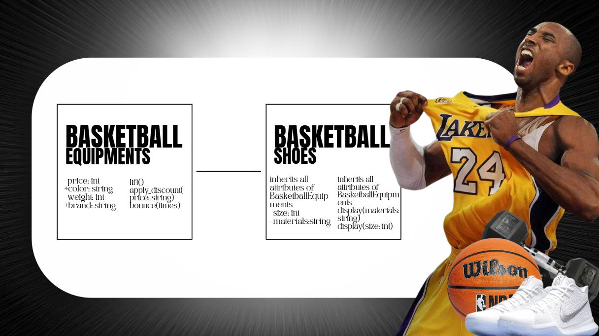
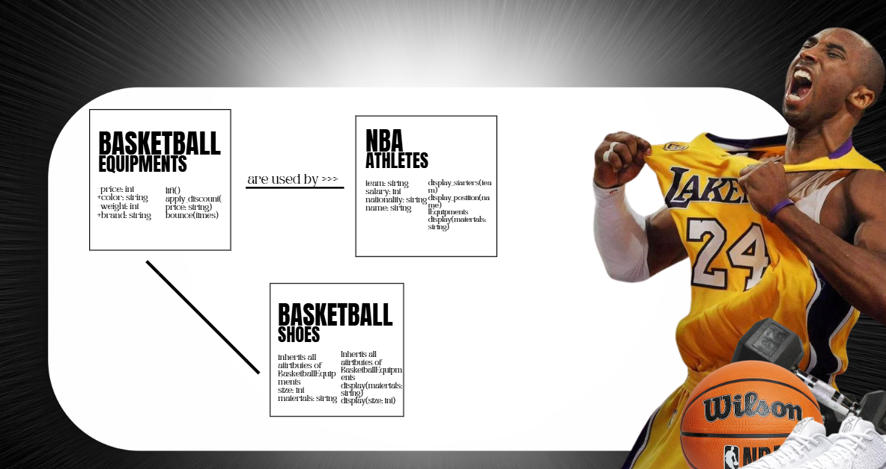
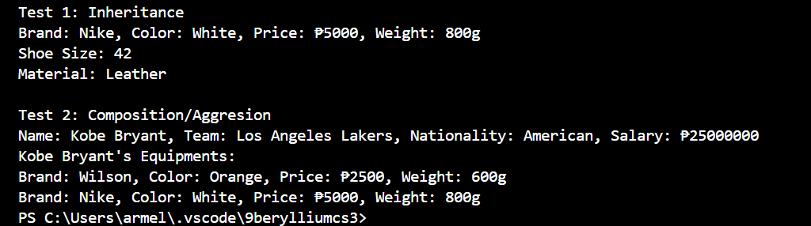
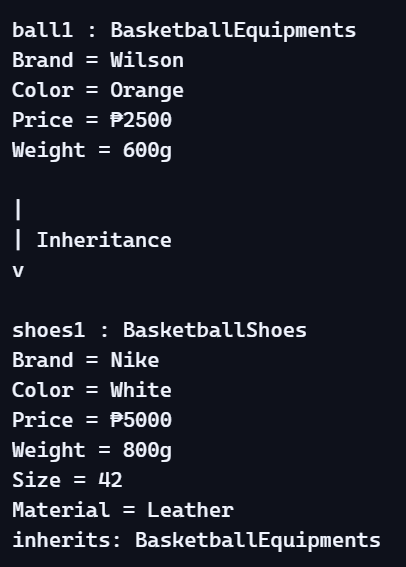

# Advanced Class Relationships
## Previous Activities
[classAttrib](quarter1/classAttributesMethods.md)
[classRel](quarter1/classRelationships.md)
## Existing System Description:
### 1.) Class 1: BasketballEquipments 

###     Class 2: NBAAthletes 

### 2.) A limitation in the current design is the one-way linkage between NBAAthletes and BasketballEquipments. Athletes can collect, manage, and display their equipment objects, but the equipment class itself has no awareness of the athlete context. This asymmetry prevents an item from tracking its own usage or ownership state, leaving NBAAthletes solely responsible for maintaining all relationship and activity data. 

## Inheritance Relationship
Parent: BasketballEquipments

Child: BasketballShoes

Explanation: The parent class BasketballEquipments defines attributes like its price, weight, color, and brand. The child class BasketballShoes inherits all these core properties but extends functionality to include specialized features such as size, materials used etc. This specialization allows BasketballShoes to enforce fit validations, durability checks, and usage restrictions, distinguishing it from the more general equipment category 

## Inheritance UML

## Composition/Aggregation
Relationship: Aggregation
Explanation: The relationship between Basketball Equipments and Basketball Shoes is Aggregation because it has a weak “HAS-A” relationship. This shows that Basketball Shoes can still exist even without Basketball Equipments. It proves that “the object contains another object, but the contained object can exist independently.”

## Advanced UML Diagram

## Python Implementation
[Source Code](advancedRelationships.py)

## Test Run

## Object Diagram

## Reflection
Answers:

1. Why did you choose your inheritance relationship? Explain why your child class is a type of your parent class.           I chose BasketballShoes as a child of BasketballEquipments because shoes are a specific type of equipment. The parent class holds general attributes like brand, color, price, and weight. On the other hand, the child class specializes by adding size and material that results to extend them with unique features. 

3. How did inheritance reduce duplicate code? Identify attributes or methods that were reused.                    Inheritance allowed me to reuse the attributes and methods from BasketballEquipments in BasketballShoes without rewriting them. For example, the attributes like brand, color, price, and weight were inherited directly. This reduced errors in being redundant and kept the code cleaner by avoiding repeated definitions.

4. Why is your HAS-A relationship Composition or Aggregation? Explain the lifecycle relationship between the two objects.
The relationship between BasketballEquipments and BasketballShoes is Aggregation. Shoes are modeled as a specialized equipment object that can exist independently of the general equipment class. Even if the BasketballEquipments object is removed, the BasketballShoes object can still exist on its own with its unique attributes like size and material.

5. What is the difference between Association from Part III and the advanced relationship you implemented?
Association in the earlier activity was more about showing simple links between classes without much detail. In this advanced design, the relationships go deeper and add more structure. Instead of just connecting classes, the new relationships show hierarchy, ownership, and usage in a clearer way. 

6. How does your design follow the DRY principle?
The design avoids repeating the same details in multiple places. By keeping shared information in one class and letting other parts of the system use it, the code stays simpler and easier to manage. This way, the system feels more organized and doesn’t waste effort by writing the same thing over and over again.
