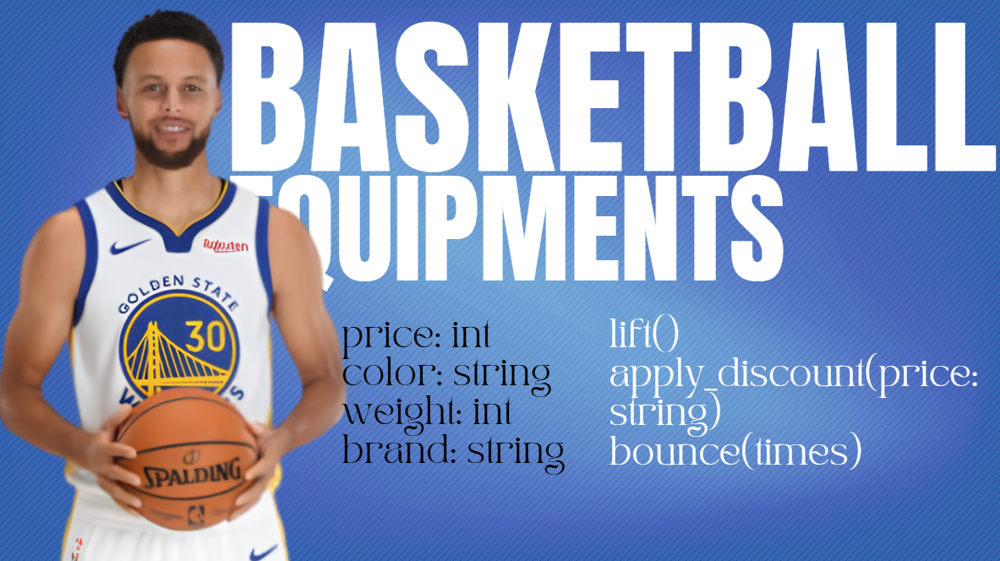
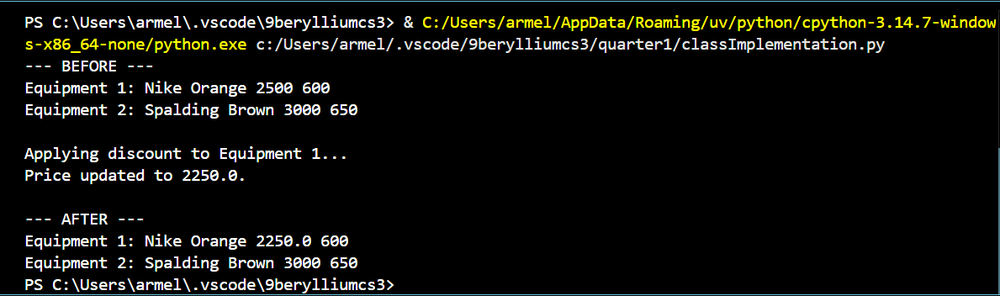
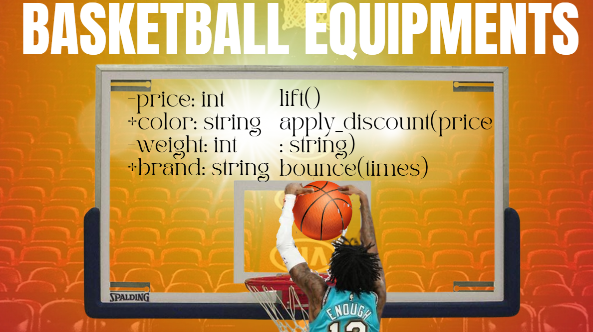

# Class Attributes and Methods

## Previous Design

Link to my previous activity:
[classObjectUML.md](classObjectUML.md)

## Design Revision
I changed the method from displayinfo(brand) to apply_discount(price) to make it less complicated. In code for example, the equipment is priced Php 5000, then after applying discount, the price will lessen. And another method i changed is the bounce which i added a parameter times to bounce.

## Visibility Decisions
| Attribute | Data Type | Visibility | Reason |
|---|---|---|---|
|price  |int |private |It is because the attribute “price” is to project internal data. |
|color |string |public |Because the attribute “color” can be accessed outside the class. |
|weight |int |private |Because the attribute “weight” is to project internal data or data that is not disclosed to the public. |
|brand |string |public |Because the attribute “brand” is not only limited to this class. |

## Updated UML Class Diagram

## Python Implementation
[View Python Source](quarter1/classImplementation.py)

## Test Run

## Object Diagram

## Analysis
### Why did you make your chosen attribute private? I made price and weight private because they project internal data. If other parts of the program could change them directly, someone might accidentally set a negative price or an unrealistic weight, breaking the logic of the class. 

### Which method changes the state of your object? The method that changes the state is apply_discount(price). It directly modifies the private price attribute by reducing it based on the discount price. 

### How did your two objects demonstrate that instances are independent? In the test run, equipment1 (Nike, Orange, 2500, 600) had its price reduced to 2250 after applying a discount of 250. equipment2 (Spalding, Brown, 3000, 650) stayed the same because no discount was applied to it. 

### What is the difference between your class diagram and your object diagram? Both class diagram and object diagram shows the properties and methods of the class but the main difference is the object that shows whether it’s a positive or negative attributes.

