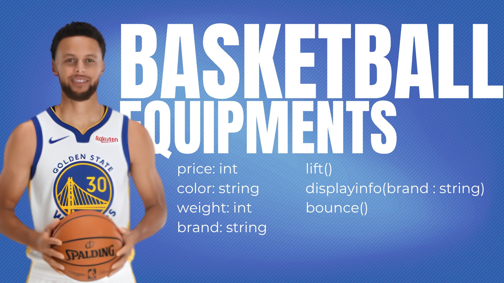

# SG4 - Understanding Classes and Objects
## Class Name: Basketball Equipment
## Class Description: The class “Basketball Equipments” represents the tools or equipment that is used in basketball like the ball itself, the weights for training, and other apparatus that aids basketball athletes in doing the sport. 

## Properties
| Property | Data Type | Description |
|---|---|---|
|price |int |Price of the equipment |
|available |boolean |Availability of the equipment |
|weight |int |Weight of the equipment |
|brand |string |Brand of the equipment |
## Methods
| Method | Description |
|---|---|
|lift() |To lift the equipment |
<<<<<<< HEAD
|bounce(times) |To bounce the equipment how many times |
=======
|bounce() |To bounce the equipment |
>>>>>>> 75d475cbbd268aabc2172ec85115f520ccbcabad
|display(color) |To display the color of the equipment |
## Class Diagram

## Design Explanation
# Why did you choose this class?
## I chose the Basketball Equipment class because it shows the tools used by athletes to become better in basketball. See Stephen Curry for example, he is big with muscles, he probably used weights to lift them. See Allen Iverson too as an example, his handles are made of gold, to master that he bounced balls and dribbled to achieve that kind of ball control.

# Which property is the most important? Why?
## For me it is the price for the customers or athletes to see whether what is better in prices. If you're on a budget the cheaper ones will attract you and if you have money, you  can choose freely.

# Which method is the most useful? Why?
## For me it is the displayinfo(brand) as it displays the information on the brand and can help athletes and buyers to learn more about the brand. It provides a clear path for people to choose equipment brands wisely. 
