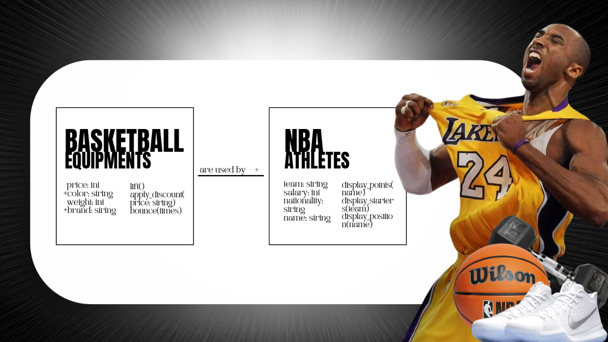
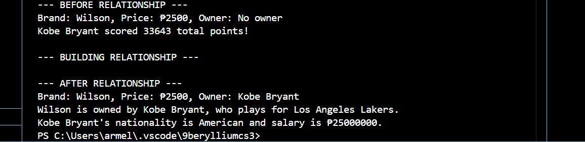
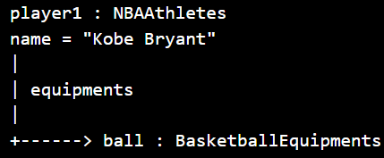

# Class Relationships: Association and Multiplicity
## Previous Work
[Part I - Classes and Objects](quarter1/classObjectUML.md)
[Part II - Class Attributes and Methods](quarter1/classAttributesMethods.md)
## Existing Class
Class: Basketball Equipments
Description: The class “Basketball Equipments” represents the tools or equipment that is used in basketball like the ball itself, the weights for training, and other apparatus that aids basketball athletes in doing the sport.
## New Related Class
Class: NBA Athletes
Description: The class “NBA Athletes” represents the people or athletes that play basketball professionally in the National Basketball Association or the NBA. It may be the names known worldwide like Stephen Curry, or Lebron, or names that are unknown for many like the youngsters present in the league.
## Association
Relationship: Basketball Equipment is used by NBA Athletes.
Explanation: The athletes from the NBA are using basketball equipment to improve them in terms of how they play, their body, etc…
## Multiplicity
Multiplicity: one to one
Explanation: One basketball equipment can be used by an NBA athlete at a time.
## UML Class Relationship Diagram

## Python Implementation
[View Python Source](quarter1/classRelationships.py)
## Test Run

## Object Relationship Diagram

## Analysis
### What is the association between your two classes?  The association of my classes is just simple. It is just that a BasketballEquipments object can be linked to an NBAAthletes object. It shows which player uses or owns the equipment. 
### What multiplicity did you choose and why? I chose a one-to-one multiplicity. In the test run, choosing this helps keep the example simple and easy to demonstrate. While this is happening, it still shows how my classes can be connected.  
### How did you implement the relationship in Python?  The relationship was implemented in Python by storing a reference to the athlete object inside the equipment class. This was done through the assign_owner() method. It allows the equipment to directly access the player’s attributes.
